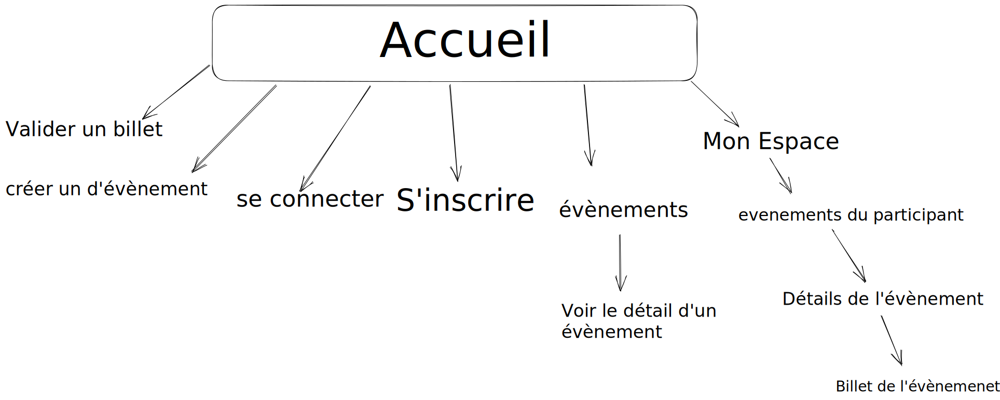

# BILLETERIE PHP

## Pages

### Barre de navigation: 
```
-> Créer un évènement
-> Connexion
-> Inscription
-> évènements
-> Mon espace
```
### Page d'accueil :
```
-> les catègorie d'évènement
```
### Créer des événements :
``` 
Formulaire
```
### La page de tous les évènement :
```
- le nom de l'évènement
- la date de l'évènement
- le nombre de participant 
```
### La Page d'un évènement : 
```
Auteur de l'évènement :

-> Modifier
-> Annuler un événement
-> Ajouter un visiteur à l'événement
-> Annuler un visiteur à l'événement
-> voir tous les participants

Participant :

-> S'inscrire a l'évènement
```
### Page de connexion :
``` 
Formulaire
```
### Page d'inscription : 
```
Formulaire
```
### Page de téléchargement d'un billet : 
```
- Nom du visiteur
- Nom de l'événement
- Date de l'événement
- Date de génération de ce billet
- qrCode permettant de valider le billet 
```

### Page espace participant
```
Participant:
-> Voir ces évènement
-> Annuler sa participation a un évènement
```

### Page de validation d'un billet
```
formulaire avec :

- Le nom du visiteur
- Le code public du billet

organisateur : 

-> Valider un billet
```

# Chemin utilisateur




# Organisation

- Mobile first : 390 * 844
- Se mettre au format mobile avant de commencer a coder :
```
click-droit => inspecter => vue adaptative
```

- Pour lancer le serveur php

```shell
php -S localhost:3000
```

- Pour visualiser les page en cour de création :

```
localhost:3000/pages/ma-page.php
```

- index.php + home.css  > William 
- createEvent.php + css > William 
- La page de tous les évènement  > William 
- La Page d'un évènement > Tom
- Page de connexion > Lucas
- Page d'inscription > Lucas
- Page de téléchargement d'un billet  > Tom
- Page espace participant > Lucas
- Page de validation d'un billet > Tom 
