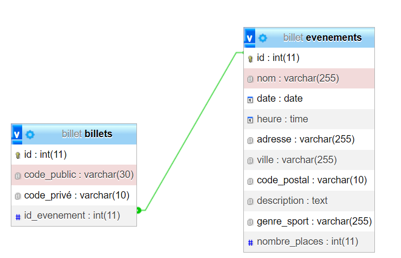

# LOGGER PHP

description de l' API

## Use case
l'utilisateur doit pouvoir se connecter, se déconnecter, afficher un billet, et valider le billet 
-> en ce qui concernet l'espace réservé à l'équipe de gestion des événements 
- ils doivent pouvoir créer, modifier, et annuler un événement
-ajouter et annuler un visteur à l'événement 
- Visualiser les événements et leurs inscrits 
## MCD

## Routing de l'API

|  METHODE  |  PATH  |  DESCRIPTION  |
|  -------  |  ----  |  -----------  |
|GET|/users/getAllUsers|liste de tous les utilisateurs|
|-------|----|-----------|
|-------|----|-----------|
|-------|----|-----------|
|-------|----|-----------|